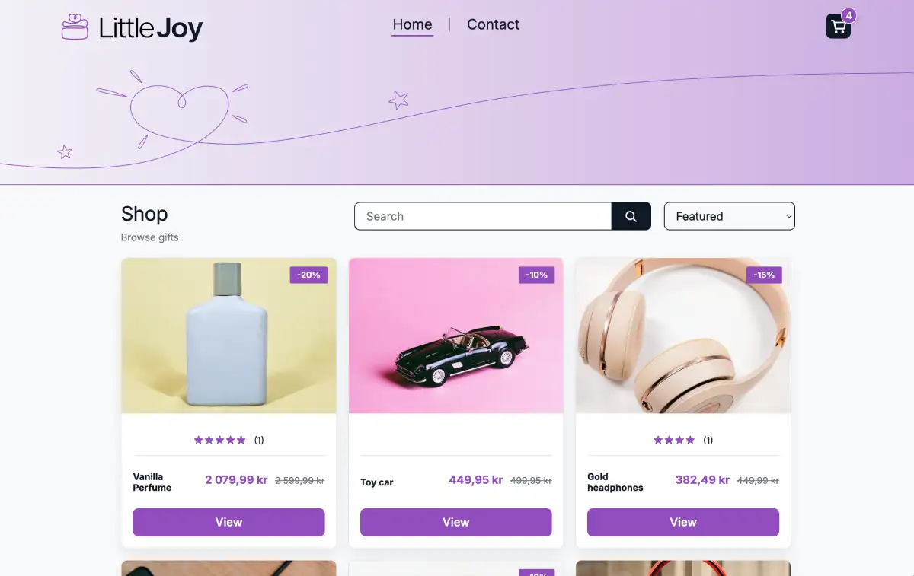

# Little Joy Shop



Little Joy Shop is a single-page online shop built with **Vite, React, TypeScript**, and **Bootstrap 5** with small custom `ui-` classes. The application lets users browse products, search, view product details, manage a cart, and complete a checkout flow.

## Live demo

- Live site: [Little Joy Shop](https://littlejoy-shop.netlify.app)

## Repository

- GitHub repo: https://github.com/KatjaTurnsek/jsfw-2025-v1-katja-jsframeworks-ca

## Tech stack

- Vite + React
- TypeScript
- React Router
- Bootstrap 5
- Custom CSS with `ui-` prefixed classes
- Prettier
- ESLint

## Features

- Home page product grid fetching products from the Noroff API
- Product search with dropdown results
- Product sorting by price, rating, and title
- Product details page with price, discount, tags, rating, and reviews
- Cart functionality:
  - Add to cart
  - Cart badge count in header
  - Update quantity
  - Remove item
  - Total cost
- Toast notifications for cart actions
- Checkout success page that clears the cart
- Contact form with validation
- Loading and error states for API calls
- Responsive layout for mobile, tablet, and desktop

## Portfolio 2 Improvements

For Portfolio 2, I reviewed Little Joy Shop as a professional portfolio project and made a focused usability improvement to the product search.

Before the update, searching for a product with no matching result did not give the user clear feedback. This could make the search feel broken or unfinished. I added a no-results message that tells the user when no products were found and suggests trying a different search term.

I also reviewed the search result thumbnail markup so the product title is not repeated unnecessarily for screen readers. This keeps the search results easier to understand while preserving the existing visual design.

**Improvement commit:** https://github.com/KatjaTurnsek/jsfw-2025-v1-katja-jsframeworks-ca/commit/cec4ad9

## API

This project uses the Noroff Online Shop API:

- `GET https://v2.api.noroff.dev/online-shop`
- `GET https://v2.api.noroff.dev/online-shop/:id`

## Getting started

Clone the repository and install dependencies:

```bash
git clone https://github.com/KatjaTurnsek/jsfw-2025-v1-katja-jsframeworks-ca.git
cd jsfw-2025-v1-katja-jsframeworks-ca
npm install
npm run dev
```

## Scripts

```bash
npm run dev          # start dev server
npm run build        # production build
npm run preview      # preview production build locally
npm run lint         # run eslint
npm run format       # format with prettier
npm run format:check # check formatting
```

## Project notes

- Custom styling uses `ui-` prefixed classes on top of Bootstrap.
- Cart state is persisted with `localStorage`.
- SPA redirects are handled for Netlify deployment.

## Deployment

Deployed with Netlify.

## Author

**Katja Turnšek**  
Front-End Development Student  
[Portfolio Website](https://katjaturnsek.github.io/portfolio/)
